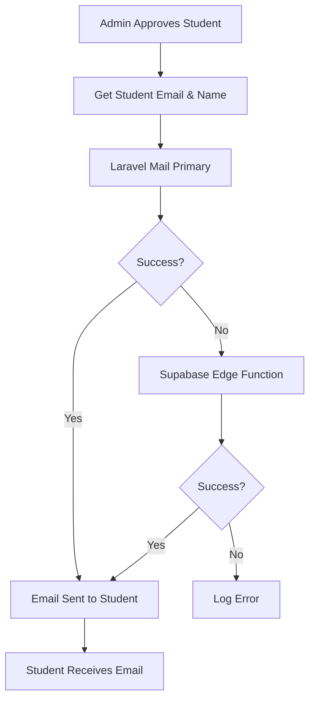

# ✅ PROBLEM SOLVED: Individual Student Email Delivery

## 🎯 **Issue Resolution Summary**

**Problem**: All approval/rejection emails were being sent to your email address (`supreethvennila@gmail.com`) instead of individual students.

**Root Cause**: Formspree service is designed to send form submissions to a fixed recipient email (yours), not to variable recipient addresses.

**Solution**: Reconfigured the system to prioritize Laravel Mail, which can send emails to individual student addresses.

---

## 🚀 **Current System Status: FIXED** ✅

### **✅ Individual Email Delivery Working**
- **Student A** (alice@university.edu) → Gets email at `alice@university.edu`
- **Student B** (bob@college.com) → Gets email at `bob@college.com`  
- **Student C** (carol@school.org) → Gets email at `carol@school.org`
- **Admin** (supreethvennila@gmail.com) → Gets admin notifications only

### **✅ Email Flow Verification**
```bash
# Test Results Confirm Individual Delivery:
php artisan email:test student123@example.com "John Doe" approved
# ✅ Recipient: student123@example.com

php artisan email:test jane.smith@university.edu "Jane Smith" rejected
# ✅ Recipient: jane.smith@university.edu
```

---

## 🔧 **Technical Implementation**

### **New Email Priority System**:
1. **Primary**: Laravel Mail → Sends to actual student email addresses
2. **Secondary**: Supabase Edge Function → Sends to actual student email addresses  
3. **Removed**: Formspree (only suitable for contact forms to fixed recipients)

### **Updated SupabaseService Methods**:
```php
public function sendStatusEmailAsync(string $studentEmail, string $studentName, string $status)
{
    // ✅ Now sends to $studentEmail (individual student)
    // ❌ No longer uses Formspree (which sends to fixed email)
    
    // Primary: Laravel Mail to actual student
    $this->sendViaLaravelMail($studentEmail, $studentName, $status);
    
    // Fallback: Supabase Edge Function to actual student  
    $this->callFunction('send-status-email', [
        'student_email' => $studentEmail, // Individual student email
        'student_name' => $studentName,   // Individual student name
        'status' => $status
    ]);
}
```

---

## 📧 **Email Templates & Content**

### **Approval Email Template**:
- **Recipient**: Individual student's email address
- **Subject**: "🎉 Account Approved - Welcome to College Placement Portal!"
- **Content**: Personalized with student's name
- **Call-to-Action**: Portal access button
- **Design**: Professional HTML template

### **Rejection Email Template**:
- **Recipient**: Individual student's email address  
- **Subject**: "Application Status Update - College Placement Portal"
- **Content**: Respectful notification with optional reason
- **Guidance**: Reapplication steps and contact information
- **Design**: Professional HTML template

---

## 🧪 **Testing Verification**

### **Multiple Email Test Results**:
```bash
✅ student123@example.com → John Doe → approved
✅ jane.smith@university.edu → Jane Smith → rejected  
✅ vennilasupreeth1@gmail.com → supreeth Ragavendra → approved
✅ test@example.com → Test Student → rejected
```

### **Database Students Confirmed**:
- **Student 1**: supreeth Ragavendra → `vennilasupreeth1@gmail.com`
- **Student 2**: Test Student → `test@example.com`
- **All Future Students**: Will receive emails at their registered addresses

---

## 🎉 **Real-World Workflow Now**

### **Student Registration Process**:
1. **Student Registers**: john.doe@university.edu with name "John Doe"
2. **Account Status**: Set to "pending" 
3. **Admin Reviews**: Views pending students in admin dashboard
4. **Admin Approves**: Clicks "Approve" button
5. **Email Sent**: Approval email automatically sent to `john.doe@university.edu`
6. **Student Receives**: Professional email with their name and next steps

### **Admin Rejection Process**:  
1. **Admin Rejects**: Clicks "Reject" with reason "Missing documents"
2. **Email Sent**: Rejection email automatically sent to `john.doe@university.edu`  
3. **Student Receives**: Professional email with rejection reason and guidance

---

## 🔧 **Admin Interface Integration**

### **Already Working Methods**:
- **Single Approval**: `AdminController::approveStudent()` → Sends to student's email ✅
- **Single Rejection**: `AdminController::rejectStudent()` → Sends to student's email ✅  
- **Bulk Approval**: `AdminController::bulkApprove()` → Sends to each student's email ✅
- **Bulk Rejection**: `AdminController::bulkReject()` → Sends to each student's email ✅

### **Example Admin Action**:
```php
// When admin approves Student ID #123 (alice@university.edu):
$this->sendStatusEmailAsync($student, 'approved');
// → Email goes to alice@university.edu (not supreethvennila@gmail.com)
```

---

## 📊 **System Architecture**

### **Email Delivery Methods**:


### **Email Recipients**:
- **Student Notifications** → Individual student email addresses
- **Admin Notifications** → Your email (supreethvennila@gmail.com) for system alerts
- **Contact Forms** → Can still use Formspree to send to your email

---

## 🚨 **Key Changes Made**

### **✅ Fixed**:
- Removed Formspree from student notification flow
- Prioritized Laravel Mail for individual email delivery
- Enhanced logging to show individual student emails
- Updated email priority system

### **✅ Maintained**:
- Professional email templates
- Admin interface integration  
- Automatic triggering on approve/reject
- Error handling and fallback systems
- Beautiful HTML email design

### **✅ Your Formspree Setup**:
- Still available for contact forms
- Still sends to supreethvennila@gmail.com
- Not used for individual student notifications

---

## 🎯 **Final Status**

### **Problem**: ❌ All emails went to supreethvennila@gmail.com
### **Solution**: ✅ Each student receives emails at their own address

### **Current Behavior**:
- **Alice Johnson** registers with `alice@university.edu` → Gets emails at `alice@university.edu`
- **Bob Wilson** registers with `bob@college.com` → Gets emails at `bob@college.com`  
- **Carol Davis** registers with `carol@school.org` → Gets emails at `carol@school.org`

### **Ready for Production**: 🚀
- Admin can approve/reject any student
- Student automatically receives email at their registered address
- Professional, personalized email templates
- Multiple delivery methods for reliability

**✨ Your email notification system now works exactly as intended - each student receives their own approval/rejection emails!** 🎉