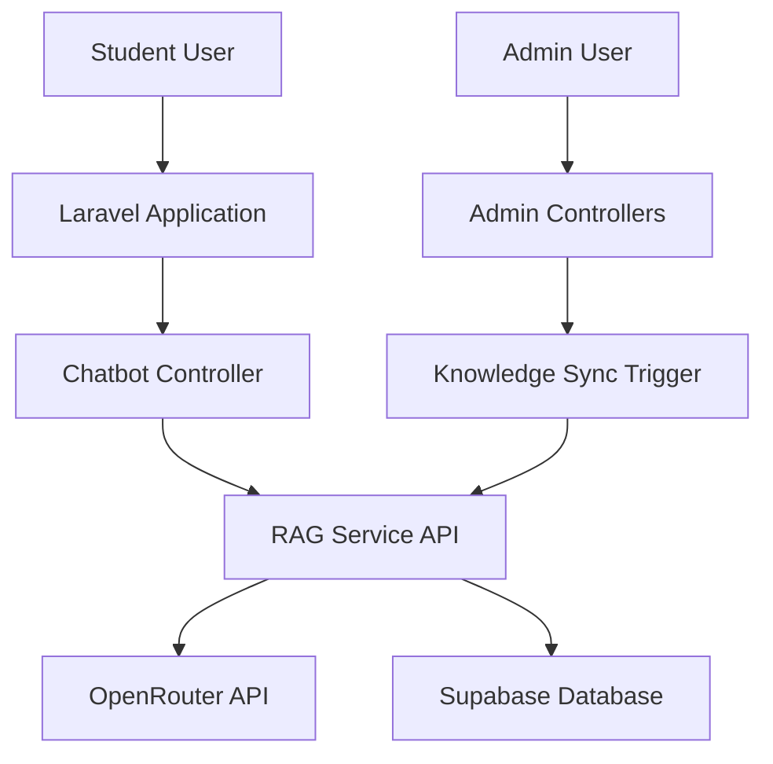

# RAG System Architecture

This document describes the architecture of the OpenRouter RAG system for the College Placement Portal.

## System Overview

The RAG system consists of two main components:
1. **Python RAG Service** - A FastAPI-based service that handles AI interactions and data synchronization
2. **Laravel Integration** - Integration with the existing Laravel application for frontend interaction

## Architecture Diagram

## Component Details

### 1. Python RAG Service

The Python RAG service is built with FastAPI and consists of several modules:

#### Main Service (main.py)
- FastAPI application server
- REST API endpoints for chat, sync, health checks
- Service initialization and configuration

#### OpenRouter Client (openrouter_client.py)
- Handles API calls to OpenRouter
- Implements model fallback mechanism
- Manages authentication and headers
- Error handling and retry logic

#### Knowledge Sync (knowledge_sync.py)
- Connects to Supabase PostgreSQL database
- Retrieves student context and assessment data
- Handles data synchronization
- Manages database connections

#### Context Handler (context_handler.py)
- Processes student queries
- Builds context-aware prompts
- Classifies query types
- Manages conversation flow

#### Response Formatter (response_formatter.py)
- Formats AI responses for frontend consumption
- Structures data in JSON format
- Generates follow-up questions and actions

#### Initial Knowledge Builder (init_knowledge.py)
- Initializes static knowledge base
- Tests OpenRouter API connectivity
- Sets up initial data synchronization

#### Incremental Sync (incremental_sync.py)
- Handles incremental updates to knowledge base
- Tracks changes since last sync
- Efficiently updates only changed data

### 2. Laravel Integration

#### Chatbot Controller
- Handles student chat requests
- Communicates with RAG service via HTTP
- Processes and returns formatted responses
- Implements error handling and fallbacks

#### Admin Controllers
- AssessmentController - Triggers sync on assessment changes
- QuestionController - Triggers sync on question changes

### 3. Data Flow

#### Student Query Flow
1. Student sends message through chat interface
2. Laravel ChatbotController receives request
3. Controller forwards request to RAG service
4. RAG service retrieves student context from database
5. Context Handler builds prompt with context
6. OpenRouter Client sends prompt to OpenRouter API
7. OpenRouter processes query and returns response
8. Response Formatter structures the response
9. Laravel Controller receives response and sends to frontend

#### Knowledge Sync Flow
1. Admin creates/updates/deletes assessment or question
2. Laravel Admin Controller triggers RAG sync
3. RAG service receives sync request
4. Knowledge Sync module connects to database
5. Data is retrieved and processed
6. Knowledge base is updated with new information

## Security Architecture

### Data Isolation
- Each student can only access their own data
- Context filtering ensures data privacy
- Database queries are parameterized to prevent injection

### API Security
- OpenRouter API key is stored securely in environment variables
- RAG service only accepts requests from localhost
- Communication between Laravel and RAG service is local

### Authentication
- Laravel handles user authentication
- Student ID is passed to RAG service for context retrieval
- No direct access to RAG service without authentication

## Performance Considerations

### Caching
- Laravel implements response caching
- Database connections are pooled
- Knowledge sync operations are optimized

### Scalability
- Service can be scaled horizontally
- Database queries are optimized
- API calls include appropriate timeouts

### Reliability
- OpenRouter API includes fallback mechanism
- Error handling at multiple levels
- Health checks for monitoring

## Data Models

### Student Context
- Student information (name, email)
- Available assessments
- Completed assessments with scores
- Performance statistics

### Assessment Data
- Assessment details (title, description, category)
- Question information
- Timing and duration data

### Knowledge Base
- Static portal information
- Dynamic assessment data
- Student-specific context

## Monitoring and Logging

### Logging
- Comprehensive logging in RAG service
- Error tracking and debugging information
- Performance metrics collection

### Health Checks
- Service health endpoint
- Database connectivity checks
- OpenRouter API status monitoring

## Deployment Architecture

### Development
- RAG service runs on localhost:8001
- Laravel application runs on localhost:8000
- Direct database connection for development

### Production
- RAG service deployed on same server as Laravel
- Secure internal communication
- Environment-specific configuration